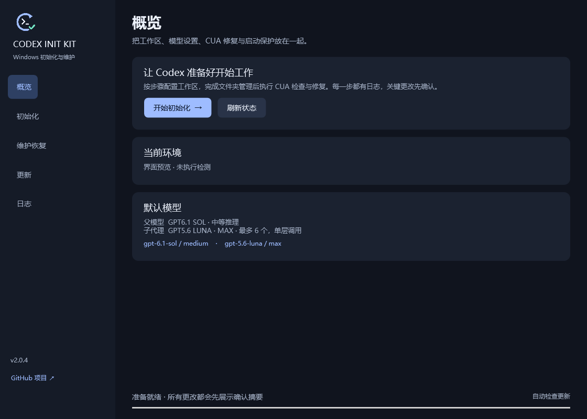
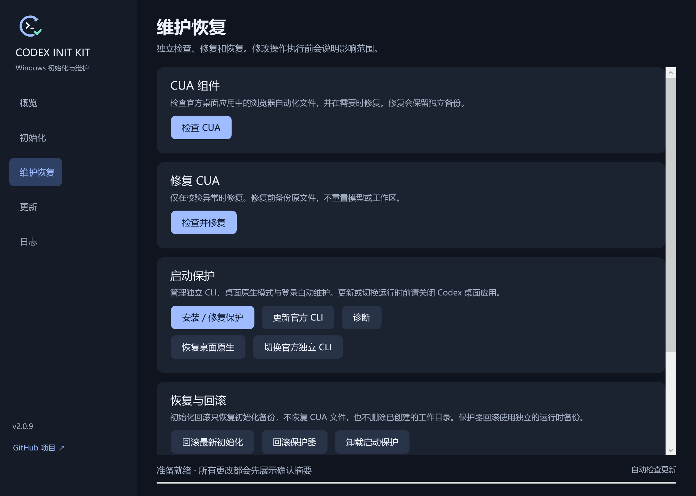

# Codex Init Kit


这是一个给 Windows 上的 Codex 做配置和维护的小工具。你不用逐个打开脚本、找配置文件：下载一个 EXE，就可以整理工作目录、重新配置模型和代理、检查电脑操作组件，以及排查部分启动问题。

**适合这些情况：刚装好 Codex 不知道怎么配置；改过配置后想重新整理；电脑操作功能缺组件；启动使用的程序路径出了问题。** 已经正常使用的人，也可以只做检查或单项修复。

**[下载桌面版](https://github.com/BerryFuwawa/codex-init-kit/releases/latest/download/CodexInitKit.exe)** · [版本发布](https://github.com/BerryFuwawa/codex-init-kit/releases) · [使用说明](docs/Desktop.md) · [脚本说明](docs/Scripts.md)

## 它能解决什么问题？

| 你遇到的情况 | 工具能帮你做什么 | 从哪里操作 |
| --- | --- | --- |
| 刚装好 Codex，不想手动配目录、模型和代理 | 按向导统一配置，并在修改前备份原来的配置 | 「初始化」 |
| 之前试过很多设置，现在想重新配置 | 备份并重建配置，清理初始化流程处理的旧运行路径设置，重新写入默认值 | 「初始化」；这是重置操作 |
| 没有绑定项目的任务不知道该存在哪里，工作文件容易混在一起 | 建立对话、项目、成品、临时文件等目录，并设置无项目任务的存放位置 | 「初始化」；已有文件不会自动搬家 |
| Codex 的电脑操作功能因为本地组件缺失或不完整而不能用 | 检查 CUA 组件，对照已安装的官方应用文件补齐或恢复，再检查一遍 | 「维护恢复」中的 CUA 检查／修复 |
| Codex 启动很慢，CUA 目录不断产生临时文件和大量小文件读写，甚至拖慢电脑 | 检查并提前补齐当前版本需要的 CUA 组件，处理组件准备异常导致的反复复制或重试 | 「维护恢复」中的 CUA 检查／修复；适用于这类原因引起的卡顿 |
| Codex 启动异常，怀疑内置组件或启动路径有问题 | 检查内置组件与官方备用运行程序，必要时修复备用组件；也能恢复使用桌面版自带程序 | 「维护恢复」中的启动保护、恢复原生模式 |
| 提示找不到 Codex CLI、CLI 路径错误，或 CLI 组件缺失／损坏 | 检查启动程序及路径，必要时安装／修复官方独立 CLI，或恢复桌面版自带 CLI | 「维护恢复」中的「安装 / 修复保护」「恢复桌面原生」 |
| 想在桌面版自带 CLI 和官方独立 CLI 之间切换 | 使用对应按钮切换，切换前检查目标组件是否可用 | 「维护恢复」中的「恢复桌面原生」「切换官方独立 CLI」 |
| 换过运行程序后出问题，想退回之前能用的版本 | 检查并回滚到启动保护记录的上一可用版本 | 「维护恢复」中的运行时回滚 |
| 本地代理端口改了，Codex 还在使用旧设置 | 按填写的端口重建代理配置 | 在「初始化」页面填写端口，再到「维护恢复」点击「更新代理」 |
| 想让 Codex 按指定规则分配子代理工作 | 写入 Luna 子代理的模型、数量和调用层级规则 | 「初始化」；实际可用模型取决于账号和当前环境 |
| 不知道故障发生在哪一步 | 查看状态、运行 Doctor 诊断，并查看执行日志 | 「概览」「维护恢复」「日志」 |
| 这个工具发布了新版，不想再手动找下载地址 | 启动时自动查更新，点击提示后下载、校验并替换自身 | 右下角更新提示 |

**这里的 CUA 修复，检查的是电脑操作功能所用的本地浏览器自动化组件。** 这项修复针对文件缺失、不完整或与当前官方应用不一致的情况。检查通过只表示组件文件完整，不等于电脑操作功能一定能使用。

### CUA 目录反复写小文件，导致启动慢或电脑卡顿

有一种情况是：Codex 启动或更新后，忙着准备电脑操作组件，在下面的目录创建临时目录、复制大量小文件，却迟迟不显示窗口：

```text
%LOCALAPPDATA%\OpenAI\Codex\runtimes\cua_node
```

公开故障报告记录过两种相关现象：复制受保护文件失败后，对大量文件逐个重试；或者组件始终没准备完整，每次启动又生成新的 `.staging-*` 临时目录。前者会让启动长时间等待，后者会反复准备组件。参见 [启动缓慢报告](https://github.com/openai/codex/issues/41822) 和 [组件复制失败报告](https://github.com/openai/codex/issues/42501)。

**本工具的 CUA 修复就是先把当前版本需要的完整组件放到正确位置，再逐文件校验。** 对这类本地组件准备异常，可以绕开下次启动时同样的失败复制或重复准备过程。如果 Codex 和整机卡顿也来自这段大量读写，修复后可能改善。

操作方法：保存工作并退出 Codex，打开本工具，到「维护恢复」先检查 CUA，发现异常后点击「检查并修复」，完成后重新启动 Codex。组件本来完整时会跳过修复；其他原因造成的卡顿需要继续排查。这个功能不修改 Codex 的官方复制代码，也不负责批量清理旧临时目录。

启动保护主要处理 Codex **启动时使用哪套程序，以及这套程序是否完整**。账号登录、模型权限、服务端故障、代理软件本身连不上网等问题，需要分别排查。这个工具不会替你开通模型权限，也不会安装或启动代理服务。

### CLI 找不到或报错，能怎么修？

可以处理因 **CLI 路径指错、残留的启动路径设置、组件缺失或损坏** 引起的部分启动故障。你可以先运行「诊断」，再按情况安装／修复启动保护，或者切换使用另一套可用的 CLI。

- **桌面版自带 CLI：** 随 Codex 桌面应用提供。点击「恢复桌面原生」，在内置组件完整时恢复这套程序，并清除本工具设置的路径覆盖。
- **官方独立 CLI：** 单独安装的 OpenAI 官方命令行程序。点击「安装 / 修复保护」检查和准备它，再用「切换官方独立 CLI」切换；也可以更新或回滚到已记录的上一可用版本。

两套都是官方程序，可以按需要来回切换，操作前请保存工作并退出 Codex。这里的切换管理 Codex 桌面应用使用的 CLI 路径；终端输入 `codex` 时提示“找不到命令”，还需要检查终端的安装和 PATH，不能直接当作同一个问题。CLI 报错如果来自登录、权限、网络或服务端，也需要另外排查。

## 第一次用，怎么选？

- **只是想检查，或者只修一个问题：** 先看「概览」，再到「维护恢复」选对应项目。
- **想把配置重新整理一遍：** 使用「初始化」。它会备份并重建配置，已有自定义设置需要重新确认。
- **想撤回本工具的修改：** 根据改动选择初始化回滚、运行时回滚或卸载启动保护。三者恢复的内容不同，见下面的「更新与恢复」。

## 下载后怎么用？

1. 下载 `CodexInitKit.exe`，放到方便访问的目录。无需另放 CMD 文件或自行编译。
2. 双击启动，在「概览」查看当前环境。
3. 需要初始化时，先保存工作并关闭 Codex，再进入「初始化」，选择工作盘与代理端口。
4. 查看变更摘要，确认后执行。需要时可同时安装启动保护。
5. 日常检查、修复或回滚，使用「维护恢复」；执行结果和备份位置可在「日志」查看。

环境要求：**Windows x64、.NET Framework 4.8、Windows PowerShell 5.1**。修改操作按需请求管理员授权。发布 EXE 尚未签名，文件校验值见发布页的 `SHA256SUMS.txt`。

> 初始化不是只做检查：它会先备份，再重建当前用户的 Codex 配置，修改代理、规则和用户 PATH，并停止相关 Codex 进程。开始前请保存工作；只想检查或修复组件时，直接使用「维护恢复」。

## 初始化具体会做什么？

| 功能 | 可以做什么 |
| --- | --- |
| 配置 | 备份原来的配置，再写入默认模型、思考强度和代理地址 |
| 文件夹 | 创建按用途分类的目录，设置无项目任务的存放位置 |
| 电脑操作组件 | 检查文件是否完整，需要时修复，修复前单独备份 |
| 子代理规则 | 写入子代理用什么模型、最多同时调用几个、能否继续委派 |
| 启动保护（可选） | 检查启动组件，准备官方备用程序，并安装登录时的自动维护任务 |

桌面版提供「概览、初始化、维护恢复、更新、日志」五个页面。也保留独立脚本入口，适合已有批处理使用习惯的用户。

### 初始化顺序

```text
选择工作盘 → 备份并重建配置 → 创建目录并验证绑定
           → 检查／按需修复 CUA → 安装并校验 Luna 规则
           → 可选安装启动保护
```

CUA 在文件夹管理完成、绑定校验通过后执行；CUA 修复失败时停止后续 Luna 安装。

### 默认设置

| 设置 | 默认值 |
| --- | --- |
| 工作根目录 | `<盘符>:\Codex`；优先选择可用的 `D` 盘 |
| 父模型 | `gpt-6.1-sol` · `medium` |
| 子代理 | `gpt-5.6-luna` · `max` |
| 并行与深度 | 最多 6 个子代理，委派深度 1 |
| 本地 HTTP 代理 | `http://127.0.0.1:10808`；端口可在向导中修改 |

工作根目录包含 `Conversations`、`Projects`、`OUT`、`Temp`、`Shared`、`Archive`、`Config` 和 `Docs` 八个子目录。已有工作文件不会自动搬迁。

## 更新与恢复

**工具更新**来自本 GitHub 仓库。每次启动时，右下角显示自动检查状态；发现新版后，右下角显示带红色亮点的「检测到更新，点击更新」。点击即下载并验证 SHA-256，退出后在原目录以原文件名替换并重启；成功后自动删除旧版，只保留新版。失败时保留原可用文件。

**Codex 备用运行程序更新**在「维护恢复」页面执行，更新的是启动保护管理的 OpenAI 官方 CLI，也就是备用的命令行程序。执行前应关闭 Codex。这与下载本工具新版是两件事，不会更新 Windows 商店里的 Codex 桌面应用。

初始化、CUA 和启动保护分别保留备份，恢复范围如下：

| 恢复操作 | 范围 |
| --- | --- |
| 回滚初始化 | 恢复最新初始化会话中记录的配置、规则及环境项目；不恢复 CUA，不删除创建的工作目录 |
| CUA 备份 | 修复前保存的运行时文件，独立于初始化备份 |
| 回滚启动保护 | 验证并恢复保护器记录的上一可用运行时 |
| 卸载启动保护 | 移除登录自动维护并恢复相关覆盖配置，保留用户数据与官方后备文件 |

桌面执行日志位于 `%LOCALAPPDATA%\CodexInitKit\Desktop\Logs`。初始化备份位于 Windows 实际 Documents 目录下的 `Codex初始化备份`。详细路径和操作边界见 [桌面版说明](docs/Desktop.md)。

## 界面展示

**概览：** 查看默认模型和当前状态，从这里进入初始化。



**维护恢复：** 检查／修复 CUA，修复启动保护，切换桌面自带或官方独立 CLI，也能诊断和回滚。



图片为 2.0.3 的离线界面预览，未执行初始化或修复；实际状态以你电脑上的检测结果为准。

## 脚本入口

| 入口 | 用途 | 内部版本 |
| --- | --- | --- |
| [第 1 步：初始化管理](scripts/第1步-Codex初始化管理-V4.7.0-GPT5.6-LUNA-MAX.cmd) | 配置初始化、目录管理、CUA、RTK 与 Luna 规则 | `4.8.1` |
| [第 2 步：启动保护与更新管理](scripts/第2步-Codex启动保护与更新管理器-V5.1.2-GPT5.6-LUNA-MAX.cmd) | 运行时保护、登录维护、更新、诊断、切换与回滚 | `5.2.1` |
| [CUA 独立入口](scripts/Codex_CUA_Repair.cmd) | 单独检查或修复 CUA | — |

两个主脚本保留原文件名，版本以内部标记为准。完整菜单、执行细节及备份位置见 [脚本使用说明](docs/Scripts.md)。

## CLI 验证与源码构建

EXE 内置无窗口验证入口，可生成 JSON 报告，无需控制桌面：

| 参数 | 用途 |
| --- | --- |
| `--verify <report.json>` | 检查资源、后台模拟回归、页面构建、参数与更新校验 |
| `--status-json <report.json>` | 读取当前环境状态 |
| `--check-update-json <report.json>` | 查询并校验 GitHub 更新清单 |
| `--render-preview <目录>` | 在内存中渲染五页预览 PNG |

命令示例和报告读取方式见 [CLI 使用说明](docs/Desktop.md#无窗口-cli-验收)。验证覆盖只读状态及模拟操作；真实配置重置、运行时切换和完整升级重启未在正在使用的 Codex 上执行。

在仓库根目录执行以下命令构建桌面版：

```powershell
powershell -ExecutionPolicy Bypass -File .\tools\Build-Desktop.ps1
```

输出为 `build\desktop\CodexInitKit.exe`。修改共同脚本更新器后，先运行 `tools/Build.ps1` 重新嵌入脚本，再构建 EXE。准备桌面发布清单使用 `tools/Prepare-DesktopRelease.ps1`。

```text
app/                     桌面界面、worker 与 CLI
scripts/                 独立批处理入口
src/GitHubUpdate.ps1      脚本更新模块
tools/                   构建和发布准备工具
tests/                   脚本更新与后台回归测试
docs/                    使用说明与版本说明
desktop-update.json      桌面版更新清单
update-manifest.json     脚本组件更新清单
```

第 1 步脚本使用 GBK，第 2 步使用 UTF-8，均保留 CRLF。仓库不提交用户密钥、机器配置、运行日志或备份文件。
